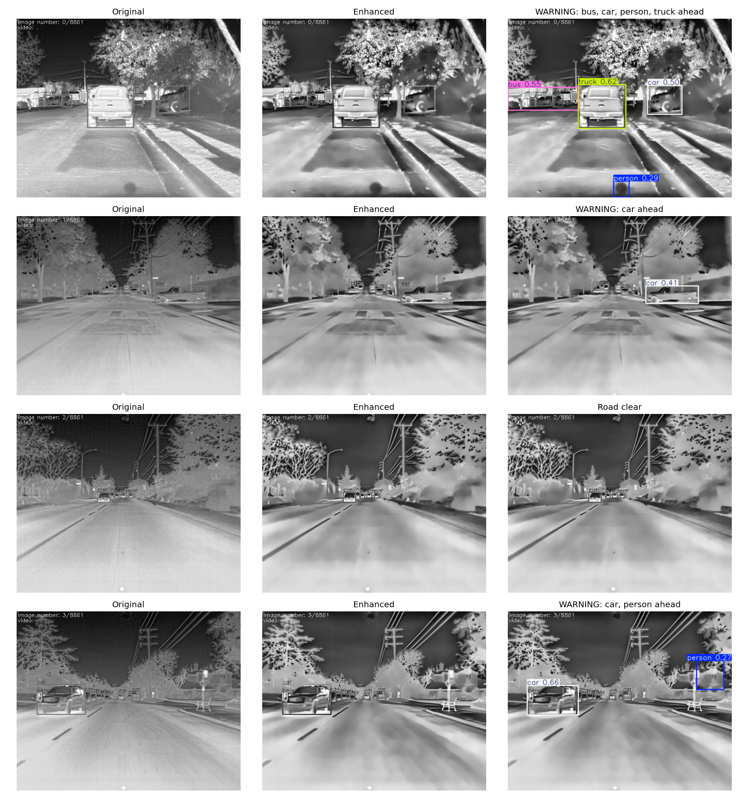

# AI-Enhanced Infrared Vision System for Low-Visibility Driving

An AI pipeline that enhances low-quality thermal (infrared) images and automatically detects people, animals and vehicles, so drivers get an early warning in dense fog and darkness.

**Live notebook (code and outputs):** [Kaggle Notebook](https://www.kaggle.com/code/riddhisharma2026/ir-vision-enhancement-for-fog-driving)

## Problem
Dense fog and night-time darkness on Indian highways make obstacles visible to drivers too late. Thermal cameras can see people, animals and vehicles in these conditions, but good ones are too expensive for ordinary cars and trucks, and low-cost sensors produce blurry, noisy images that are hard to use.

## Our Solution
A software pipeline that cleans up low-quality infrared images, detects obstacles automatically, and shows the driver a warning. The idea is to make even a low-cost infrared sensor useful for safer fog-time driving.

## How It Works
1. **Input:** a thermal image from the public FLIR ADAS dataset
2. **Enhancement:** OpenCV denoising and CLAHE contrast improvement
3. **Detection:** pretrained YOLOv8n (Ultralytics) detects people, animals and vehicles
4. **Alert:** an on-screen warning is shown when an obstacle is found (for example, "WARNING: car, person ahead"), otherwise "Road clear"

## Results
Each row shows the original thermal image, the enhanced image, and the detection output with the alert message.

On 20 sample thermal images, the detector found 17 vehicles, people and animals on the original images and 20 on the enhanced images. This is only a rough indicator from a small test: false positives are counted too, so it is not an accuracy measurement.

## Tech Stack
Python, OpenCV, Ultralytics YOLOv8, Matplotlib, Kaggle Notebooks, FLIR ADAS thermal dataset

## Limitations
- This is a proof of concept on a public dataset. It has not been tested on a live camera or on real foggy-road video.
- YOLOv8n is pretrained on normal RGB photos and is not fine-tuned on thermal data, so small or distant objects are sometimes missed and some detections are false positives.
- Denoising can soften fine detail in the image.

## Future Scope
**Technical advancement**
1. Fine-tune the detector on thermal data to improve accuracy, especially for small and distant objects.
2. Add AI super-resolution so that cheap, low-resolution infrared sensors give usable images.
3. Fuse infrared and visible-light images for more reliable detection.
4. Run it in real time on a Raspberry Pi with a low-cost IR camera and a buzzer alert for the driver.

**Real-world expansion**
5. Test on real foggy-road video and measure performance under different weather conditions.
6. Extend it to trucks, buses and ambulances, where early warning matters most.
7. Use the same pipeline for other low-visibility uses such as search and rescue in smoke, wildlife detection on highways, and night-time security.
8. Add distance estimation and voice alerts so the driver does not need to look at the screen.

## Dataset
[FLIR ADAS Thermal Dataset](https://www.kaggle.com/datasets/deepnewbie/flir-thermal-images-dataset) (via Kaggle)

## Author
Uma Sharma
